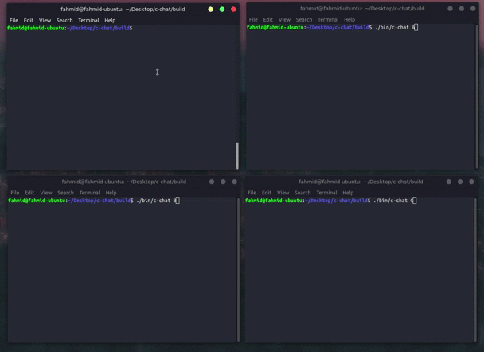

# c-chat [WIP]
Terminal chat written in C, styled with ncurses. 

### Build
```bash
mkdir build
cd build
cmake ..
make
```

### Running
Start the server:
```bash
./bin/c-server
```

Start a client(s):
```bash
./bin/c-chat USERNAME
```
<p align="center">
    
</p>

### To Do
- Proper README
- *Cooler* ncurses windows
- Handle errors for terminals that do **not** support colors
- Signal handling (for sure do something about SIGWINCH)
- Better quality gif DEMO...